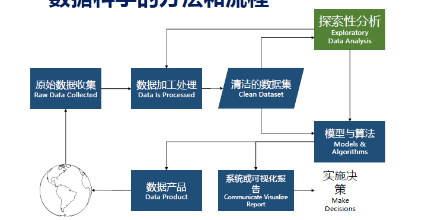

# 大数据概论  

## 大数据的特征  

1. 数据量巨大（Volume)。  
2. 数据类型繁多（Variety）。  
3. 价值密度低（Value）。  
4. 处理速度快（Velocity）。  

## 大数据人才  

  数据技术人才、管理人才、安全人才、分析人才、政策人才、开放人才、科学家。  
 
## 数据科学流程图中的每一个模块  

  

## 数据可视化的定义、分类、作用  

可视化的定义：  

1. 将不可见现象转换为可见的图形符号，并从中发现规律和获取知识。  
2. 通过可视表达增强人们完成某些任务的效率。  
3. 实质是用大脑以外的资源增强大脑本身的认知能力。  

可视化的分类：  

1. 科学可视化  
2. 信息可视化  
3. 可视分析学  

可视化的作用：  

1. 记录信息  
2. 分析推理  
3. 证实假设  
4. 交流思想  

## 基本统计图表类型  

四种常见的：柱状图与条形图、折线图、饼图、散点图。 

**箱须图**  

## 格式塔理论  

+ 最基本的法则：简单精炼法则  
+ 结构比元素重要（整体不等于部分的和）  

## 标记、视觉通道  

标记可视为基本图形，视觉通道就是这些图形的属性。  

## 数据筛选

### 数据属性  

+ 数据属性类型： 类别型属性、序数型属性、数值型属性。 

### 数据不确定性  

+ 数据不确定性的分类： 存在不确定性、属性不确定性。  
+ 数据的不确定性的产生原因： 数据采集与传输、数据精度转换、特殊应用需求、缺失值处理、数据集成。 

### 数据统计  

+ 统计特征： 把握数据全貌，了解数据分布。  
+ 统计特征的分类： 集中趋势度量、离中趋势度量、数据分布形状。  

## 可视化设计目标  

+ 信： 表达力强，真实全面；  
+ 达： 有效性强，用户容易理解；  
+ 雅： 形式与内容和谐统一；  
+ 简： 图形少，信息量多（数据墨水比大）；  
+ 善： 用意符合正确的价值观；  
+ 美： 具有艺术美感。  

## 可视化设计框架  

+ 需求分析层：概括现实生活中用户遇到的问题  
+ 数据抽象层： 抽象相应数据类型的操作  
+ 编码交互层（核心）： 设计编码和交互方法  
+ 算法实现层： 实现算法和交互  

## 数据科学的基本素养  

+ 数据科学家： 不应该成为真相的仲裁者，应该成为大社会中所发生的道德讨论的翻译者。  
+ 非数据科学家： 要明白算法不是数学测试，而是政治斗争，应该要求算法霸主承担问责。  

## 数据来源和数据源  

+ 数据来源： 产生数据的源头或者收集数据的出处。  
+ 数据源： 收集到并存储起来准备投入使用的数据。  

