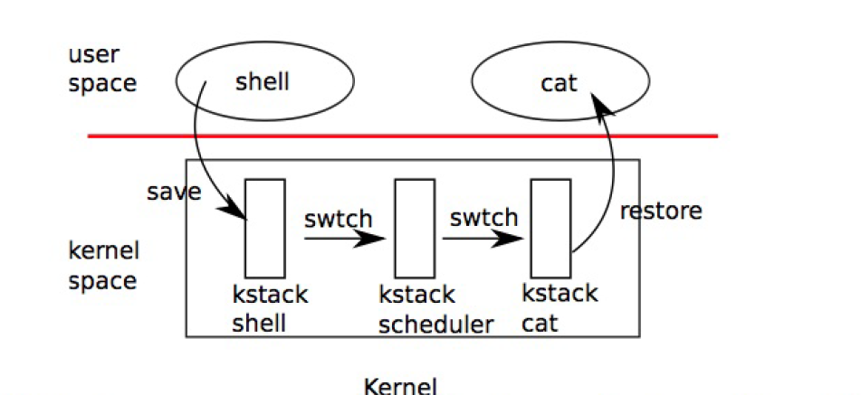

# xv6进程调度  

16040149 陈天宇

## 调度  

对于多道程序操作系统来说，调度是一个必不可少的步骤。对于一个多处理器的操作系统来说更是如此。在xv6中，力图使得调度对于进程是透明的，也就是说让进程造成一个自己独占处理器的假象。  

## 上下文切换  

xv6在低层次中实现了两种上下文切换：  

+ 从进程的内核线程切换到当前CPU的调度器线程。  
+ 从调度器线程切换到进程的内核线程。 

  

每个xv6进程都有自己的内核栈以及寄存器集合，每个CPU都有一个单独的调度器线程，这样调度就不会发生在进程的内核线程中，而是在此调度器线程中。线程的切换涉及到保存（压栈），恢复（弹栈）。 具体的代码如下：  

```s  
.globl swtch
swtch:
  movl 4(%esp), %eax
  movl 8(%esp), %edx

  # Save old callee-save registers
  pushl %ebp
  pushl %ebx
  pushl %esi
  pushl %edi

  # Switch stacks
  movl %esp, (%eax)
  movl %edx, %esp

  # Load new callee-save registers
  popl %edi
  popl %esi
  popl %ebx
  popl %ebp
  ret
 ```  

上面的代码并不了解线程，只是见到那地保存和恢复寄存器集合，也就是上下文。当进程让出CPU时，进程地内核线程调用swtch来保存自己地上下文然后返回到调度器的上下文中。 

当用户进程被调度的时候，操作系统首先会调用sched函数把相关寄存器放入CPU的寄存器中，然后再把控制权交由cpu调度器。sched函数具体如下：  

```cpp
void
sched(void)
{
  int intena;

  if(!holding(&ptable.lock))
    panic("sched ptable.lock");
  if(cpu->ncli != 1)
    panic("sched locks");
  if(proc->state == RUNNING)
    panic("sched running");
  if(readeflags()&FL_IF)
    panic("sched interruptible");
  intena = cpu->intena;
  swtch(&proc->context, cpu->scheduler);
  cpu->intena = intena;
}
  ```  

接着cpu的scheduler会通过round-robin算法在ptable里找到一个就绪的进程，然后再次将scheduler的进程切换到CPU的context中，scheduler的代码如下：  

```cpp
void
scheduler(void)
{
  struct proc *p;

  for(;;){
    // Enable interrupts on this processor.
    sti();

    // Loop over process table looking for process to run.
    acquire(&ptable.lock);
    for(p = ptable.proc; p < &ptable.proc[NPROC]; p++){
      if(p->state != RUNNABLE)
        continue;

      // Switch to chosen process.  It is the process's job
      // to release ptable.lock and then reacquire it
      // before jumping back to us.
      proc = p;
      switchuvm(p);
      p->state = RUNNING;
      swtch(&cpu->scheduler, proc->context);
      switchkvm();

      // Process is done running for now.
      // It should have changed its p->state before coming back.
      proc = 0;
    }
    release(&ptable.lock);

  }
}
 ```  

调度的控制流如下:  

```flow   
st => start: 进程1 running on cpu1  
e => end: 进程2 running on cpu1  
op1 => operation: 当前进程1的上下文交换到cpu1的scheduler  
op2 => opeartion: scheduler 查看cpu1的ptable找到一个就绪的进程2  
op3 => operation: scheduler获得进程2的上下文，把它和当前cpu1的context交换  

st -> op1 -> op2 -> op3-> end 
 ```

当然，为了安全考虑，scheduler在调度的时候首先要开启处理器的中断，这样就能允许多个进程进行竞争式抢占，而且在每次调度的时候，调度器需要锁住ptable，这样就不会出现两个CPU同时调度一个进程的现象。  

##  睡眠与唤醒  

在xv6中，sleep会将当前进程转化为SLEEPING状态并调用sched以释放CPU，而wakeup则寻找一个睡眠状态的进程并把它标记为RUNNABLE。

sleep的代码如下： 

```cpp
void
sleep(void *chan, struct spinlock *lk)
{
  if(proc == 0)
    panic("sleep");

  if(lk == 0)
    panic("sleep without lk");

  // Must acquire ptable.lock in order to
  // change p->state and then call sched.
  // Once we hold ptable.lock, we can be
  // guaranteed that we won't miss any wakeup
  // (wakeup runs with ptable.lock locked),
  // so it's okay to release lk.
  if(lk != &ptable.lock){  //DOC: sleeplock0
    acquire(&ptable.lock);  //DOC: sleeplock1
    release(lk);
  }

  // Go to sleep.
  proc->chan = chan;
  proc->state = SLEEPING;
  sched();

  // Tidy up.
  proc->chan = 0;

  // Reacquire original lock.
  if(lk != &ptable.lock){  //DOC: sleeplock2
    release(&ptable.lock);
    acquire(lk);
  }
}
```
sleep的调用者必须在当前进程并且sleep必须持有锁（因为需要修改ptable里进程的状态）  
睡眠完成后，需要调用sched切换到CPU的调度器，然后就可以空出CPU来执行其他操作。  

wakeup的代码如下：  
```cpp
static void
wakeup1(void *chan)
{
  struct proc *p;

  for(p = ptable.proc; p < &ptable.proc[NPROC]; p++)
    if(p->state == SLEEPING && p->chan == chan)
      p->state = RUNNABLE;
}

// Wake up all processes sleeping on chan.
void
wakeup(void *chan)
{
  acquire(&ptable.lock);
  wakeup1(chan);
  release(&ptable.lock);
}
 ```

wakeup要求获得ptable.lock并调用wakeup1,其中，实际工作是由wakeup1来进行的，wakeup1会找到对应chan中处于SLEEPING的进程，并且将它的进程状态修改为RUNNABLE，而wakeup则通过获得锁，防止出现异常。这里的chan参数只是一个队列的号码，对应的wakeup会唤醒对应的sleep的进程，而决定同一个队列中多个睡眠进程唤醒次序的算法仍然式round-robin。  

## wait,exit,kill  

在xv6中，当一个子进程要退出时，它并不是直接死掉，而是将状态转变为ZOMBIE，然后当父进程调用wait时才能发现子进程可以退出了。所以父进程要负责释放退出的子进程的相关的内存空间，并修改对应的struct proc一边重用。如果在子进程退出之前，父进程就已经结束了，那么初始进程init会接管子进程并等待它们退出。  

wait首先要求获得ptale.lock，然后查看进程表中是否有子进程，如果没有子进程退出，那么就sleep当前进程等待子进程退出，然后不断循环。 如果已经退出了，那么释放子进程的所有资源。

```cpp
int
wait(void)
{
  struct proc *p;
  int havekids, pid;

  acquire(&ptable.lock);
  for(;;){
    // Scan through table looking for zombie children.
    havekids = 0;
    for(p = ptable.proc; p < &ptable.proc[NPROC]; p++){
      if(p->parent != proc)
        continue;
      havekids = 1;
      if(p->state == ZOMBIE){
        // Found one.
        pid = p->pid;
        kfree(p->kstack);
        p->kstack = 0;
        freevm(p->pgdir);
        p->state = UNUSED;
        p->pid = 0;
        p->parent = 0;
        p->name[0] = 0;
        p->killed = 0;
        release(&ptable.lock);
        return pid;
      }
    }

    // No point waiting if we don't have any children.
    if(!havekids || proc->killed){
      release(&ptable.lock);
      return -1;
    }
 ```

exit首先判断当前进程是否为Init进程，初始进程时不能用exit退出的，如果不是就关闭当前进程打开的所有文件，然后唤醒父进程，如果没有父进程就唤醒init进程，然后就当前进程设置为ZOMBIE状态，进行调度。  

```cpp
void
exit(void)
{
  struct proc *p;
  int fd;

  if(proc == initproc)
    panic("init exiting");

  // Close all open files.
  for(fd = 0; fd < NOFILE; fd++){
    if(proc->ofile[fd]){
      fileclose(proc->ofile[fd]);
      proc->ofile[fd] = 0;
    }
  }

  iput(proc->cwd);
  proc->cwd = 0;

  acquire(&ptable.lock);

  // Parent might be sleeping in wait().
  wakeup1(proc->parent);

  // Pass abandoned children to init.
  for(p = ptable.proc; p < &ptable.proc[NPROC]; p++){
    if(p->parent == proc){
      p->parent = initproc;
      if(p->state == ZOMBIE)
        wakeup1(initproc);
    }
  }

  // Jump into the scheduler, never to return.
  proc->state = ZOMBIE;
  sched();
  panic("zombie exit");
}

最后是kill函数，kill允许当前进程去终结另一个进程，实质是把另一个进程的p->killed设为1，这样当存在trap函数的时候，trap函数检查到p->killed为1，就会让它exit，然后处于一个ZOMBIE的状态，等待wait函数来释放这个进程的所有资源。  

```cpp
int
kill(int pid)
{
  struct proc *p;

  acquire(&ptable.lock);
  for(p = ptable.proc; p < &ptable.proc[NPROC]; p++){
    if(p->pid == pid){
      p->killed = 1;
      // Wake process from sleep if necessary.
      if(p->state == SLEEPING)
        p->state = RUNNABLE;
      release(&ptable.lock);
      return 0;
    }
  }
  release(&ptable.lock);
  return -1;
}
 ``` 


