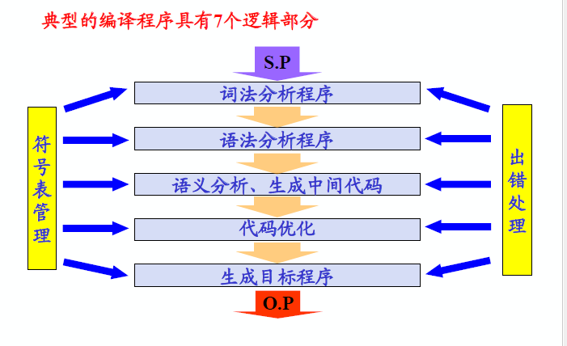

# 第一章 概论  

## 基本概念

+ 源程序：用汇编语言或高级语言编写的程序  
+ 目标程序： 用目标语言所表示的程序  
+ 翻译程序： 将源程序转换为目标程序的程序 
+ 汇编程序： 源程序用汇编语言书写，经过翻译程序得到用机器语言表示的程序，这是的翻译程序就称之为汇编程序。 
+ 编译程序： 若源程序使用高级语言书写，经加工后得到目标程序，上述翻译过程称“编译”。  
+ 解释程序： 对源程序进行解释执行的程序 
  
## 编译过程

编译过程是指将高级语言程序翻译为等价的目标程序的过程。  

+ 一般分为5个阶段：词法分析->语法分析->语义分析、生成中间代码->代码优化->生成目标程序  
  + 词法分析

    + 任务： 分析和识别单词 

  + 语法分析

    + 任务： 根据语法规则（即语言的文法），分析并识别出各种语法成分，如表达式、各种说明、各种语句、过程、函数、程序等，并进行语法正确性检查。

  + 语义分析，生成中间代码  
    + 任务: 对识别出的各种语法成分进行语义分析，并产生相应的中间代码。  

    + 中间代码： 一种介于源语言和目标语言之间的中间语言形式。  

    + 生成中间代码的目的：  
        1. 便于做优化处理；
        2. 便于编译程序的移植
    
    + 中间代码的形式：
        四元式、三元式、逆波兰表示等。

  + 生成目标程序：  
        **语义的等价性**

+ 编译程序构造

  

+ 遍（PASS）  
    对源程序（包括源程序中间形式）从头到尾扫描一次，并做有关的加工处理，生成新的源程序中间形式或目标程序，通常称之为一遍。
+ 一遍扫描即可完成整个编译工作的称为一遍扫描编译程序。  

+ 前端和后端

    + 前端：通常将与源程序有关的编译部分称为前端，主要包括词法分析、语法分析、语义分析、中间代码生成、代码优化。与**源语言**有关。  

    + 后端：目标程序生成，与**目标机**有关。 