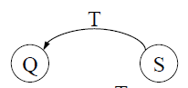
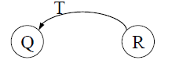
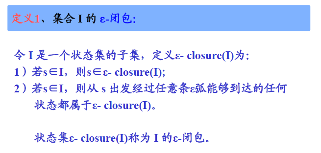
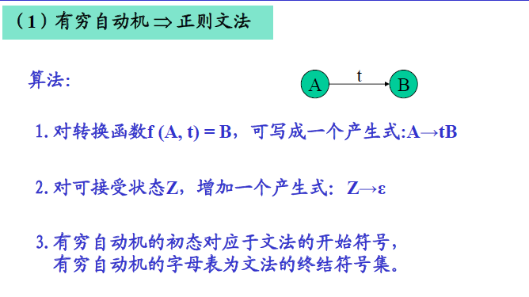
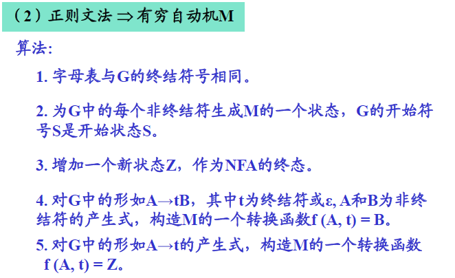
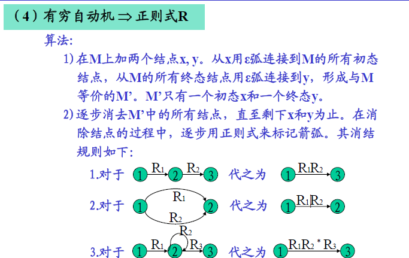
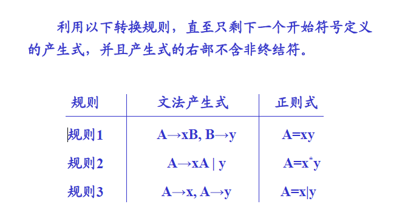

# 第三章 词法分析  

## 词法分析的功能  

+ 词法分析：根据词法规则识别及组合单词，进行词法检查。  
+ 对数字常数完成数字字符串到（二进制）数值的转换。  
+ 删去空格字符和注解。  

+ 实现方案：
    1. 词法分析单独作为一遍：
        + 优点：结构清晰、各遍功能单一  
        + 缺点： 效率低  
    2. 词法分析作为单独的子程序  

### 单词的种类

1. 保留字：begin、end、for、do...
2. 标识符：  
3. 常数： 无符号数、布尔常数、字符串常数等  
4. 分界符：+、-、*、/  

几种常用的单词内部形式：

1. 按单词种类分类  
2. 保留字和分界符采用一符一类  

### 正则文法和状态图  

+ 左线型文法状态图的画法： 

    1. 令G的每个非终结符都是一个状态；  
    2. 设一个开始状态S；  
    3. 若$Q::=T, Q\in V_n, T\in V_t$,则：  
    4. 若$Q::=RT, Q、R\in V_n, T \in V_t$,则：  
      
    5. 按自动机方法，可加上开始状态和终止状态标志。  

+ 状态图的实现——构造词法分析
    1. 单词及内部表示  
    2. 词法分析程序需要引用的公共（全局）变量和过程  
    3. 词法分析程序算法  

### 确定有穷自动机（DFA）

一个确定的有穷自动机（DFA）M是一个五元式： 
$$M = ( S, \Sigma, \delta, s_0, Z)$$ 
其中：

1. $S$ —— 有穷状态集  
2. $\Sigma$ —— 输入字母表 
3. $\delta$ —— 映射函数（也叫状态转换函数）  
4. $s_0$ —— 初始状态 
5. $Z$ —— 终止状态集  

### 非确定的有穷自动机（NFA）  

$NFA$是一个五元式:  
$$M' = (S, \Sigma \cup \left\{ \varepsilon \right\}, \delta, S_0, Z ) $$  

1. S —— 有穷状态集  
2. $\Sigma \cup \left\{\varepsilon \right\}$ —— 输入符号加上$\varepsilon$，即每个自动机的每个结点所射出的弧可以是$\Sigma$中的一个字符或是$\varepsilon$ 
3. $S_0$ —— 初态**集** 
4. $Z$ —— 终态集  
5. $\delta$ —— 转换函数

 
### NFA的确定化 

+ 集合$I$的$\varepsilon$-闭包:

 

### 有穷自动机 => 正则文法  

 

### 正则文法 => 有穷自动机M  

  

### 有穷自动机 => 正则式R  

### 正则文法 => 正则式  

  

### DFA的简化（最小化） 