# 第四章 语法分析 

功能： 根据文法规则，从源程序单词符号串中识别出语法成分，并进行语法检查。  

基本任务：识别符号串S是否为某语法成分。
两大类分析分发：

+ 自顶向下分析  
+ 自底向上分析  

## 自顶向下分析算法  

存在主要问题：

+ 左递归问题  
+ 回溯问题  

主要方法：  

+ 递归子程序法  
+ LL分析法  

## 自底向上分析算法  

存在主要问题：  

+ 句柄的识别问题  
+ 若两个以上规则的右部有相同的符号串且构成句柄，选哪个候选式  

主要方法：  

+ 算法优先分析法  
+ LR分析法  

## 自顶向下分析存在的问题及解决办法  

1. 左递归文法：

消除直接左递归：
方法一：使用扩充的BNF表示来改写文法  
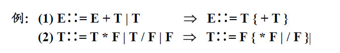  

+ 规则一（提因子）：

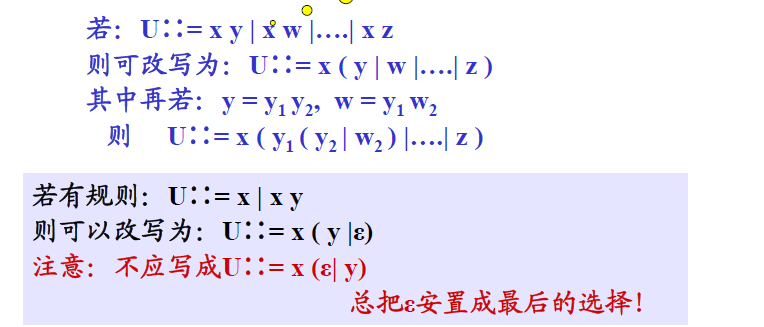  

+ 规则二：  

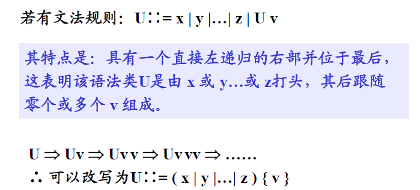  

方法二：将左递归规则改为右递归规则  

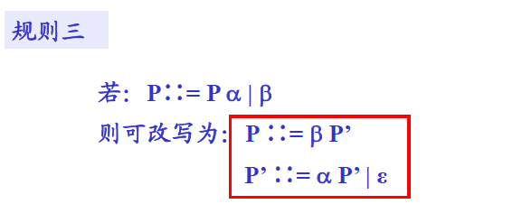  

方法三：一般算法（代入法）  

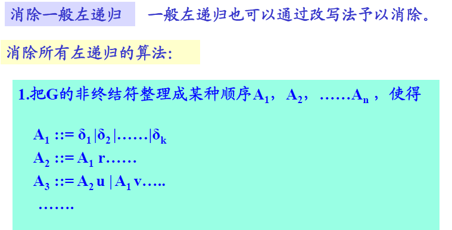  

2. 回溯问题  

**造成回溯的条件**：  
文法中，对于某个非终结符号的规则其右部有多个选择，并根据所面临的输入符号不能准确地确定所要的产生式，就可能出现回溯。  

**避免回溯的条件**：  
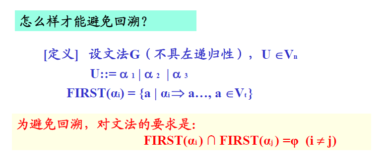  

**消除回溯的途径**：

1. 改写文法  
对具有多个右部的规则反复提取左因子 
2. 超前扫描  
当文法不满足避免回溯的条件时，即各选择的首符号相交时，可以采用超前扫面的方法，即向前侦查个输入符号串的第二个、第三个符号来确定要选择的目标。  

### 文法的两个条件  

1. 文法是非左递归的；  
2. 对文法的任一非终结符，若其规则右部有多个选择时，各选择所推出的终结符号串的首符号集合要两两不相交。  

## 递归子程序法  

1. 检查文法是否存在左递归和回溯问题  
2. 递归子程序法对应的是最左推导过程  

## LL分析法  

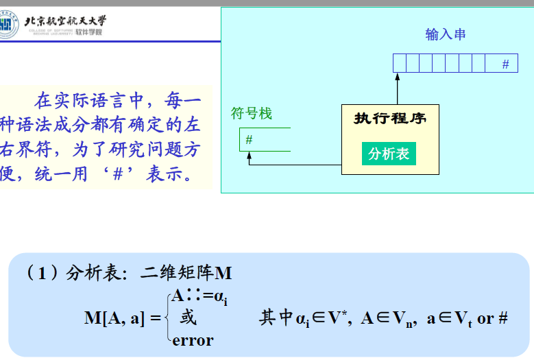  

执行过程：(**最左推导**)  
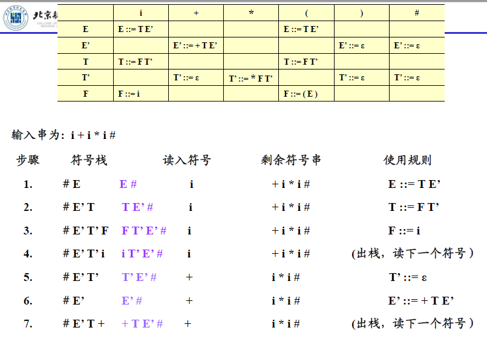  

分析表的改造：  
  

**LL(1)文法的充分必要条件**:  
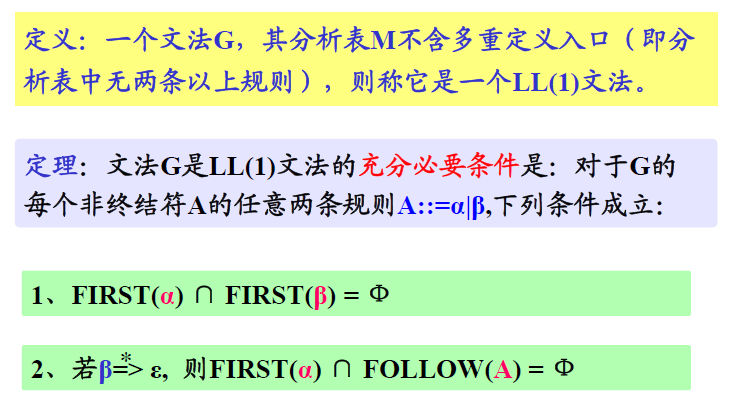  

## 自底向上分析  

分析过程步骤：

1. 找出当前句型的句柄x(或句柄的变形）；)  
2. 找出以x为右部的规则 X::= x;  
3. 把x规约为X，产生语法树的一枝。  

### 移进、规约分析  

巧合算法  

### 算法优先分析 

**特点**：仿效四则运算过程，预先规定相邻终结符之间的优先关系，然后利用这种有限关系来确定句型的“句柄”，并进行规约。  
**出错情况**：

1. 相邻终结符之间无优先关系。  
2. 对双目运算符进行规约时，符号栈中无足够项。  
3. 非正常结束状态。  

**算符文法的定义**： 不允许两个非终结符相邻。  

**优先关系**：  
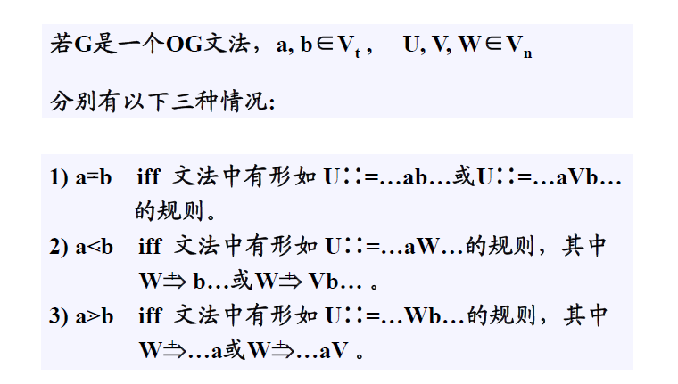  

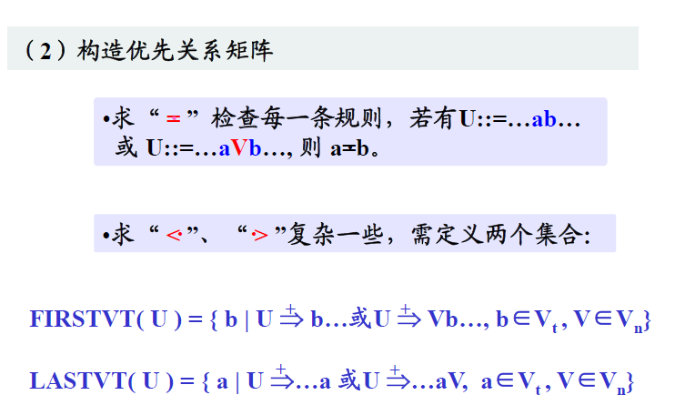  

**素短语**： 
文法G的句型的素短语是一个短语，它至少包含有一个终结符号，并且除它自身以外不再包含其它素短语。  

**最左素短语**：  
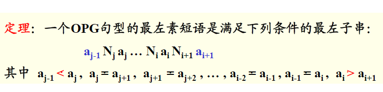  

## LR分析法  

1. SLR分析表（简单LR分析表）  
2. LR分析表（规范LR分析表）  
3. LALR分析表（超前LR分析表）  

### 仅讨论SLR分析表的构造方法  

1. 逻辑结构  

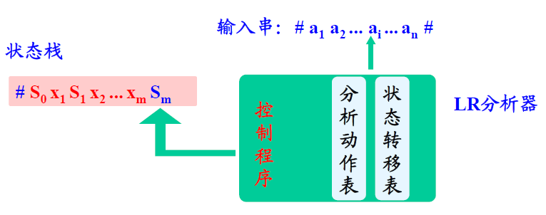  

2. 符号串：$X_1X_2......X_m$,其中$X_i\in V_n\cup V_t$ 为从开始状态($S_0$)到当前状态（$S_m$)所识别出的**规范句型的活前缀**。  

3. 规范句型： 通过规范规约得到的句型。  
4. 规范句型前缀： 将输入串的剩余部分与其连结起来就构成了规范句型。  

5. 活前缀： 若分析过程能够保证栈中符号均是规范句型的前缀，则表示输入串已分析过的部分没有语法错误，所以称为规范句型的活前缀。  

分析过程：  
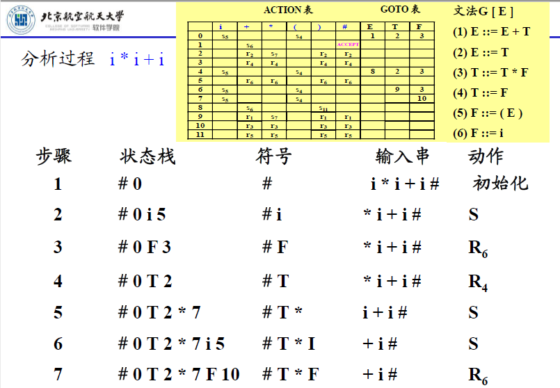  
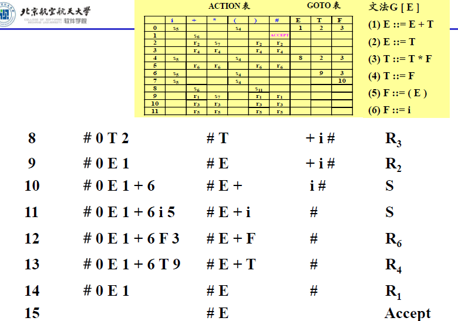  

#### 分析过程总结

1. 每次规约总是规约当前句型的句柄，是规范规约。（而算符优先是规约最左素短语） 
2. 分析的每一步栈内符号串均是规范句型的活前缀，且与输入串的剩余部分构成规范句型。  

#### 构造LR分析表  

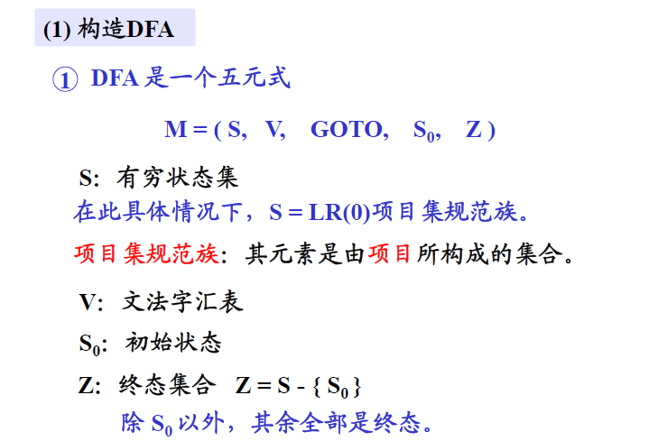  

具体构造方法建议看书，PPT上的太过笼统  
