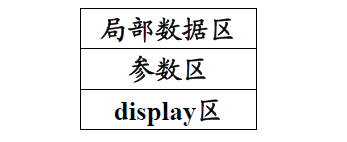
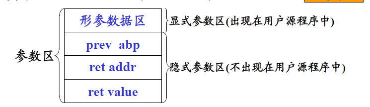
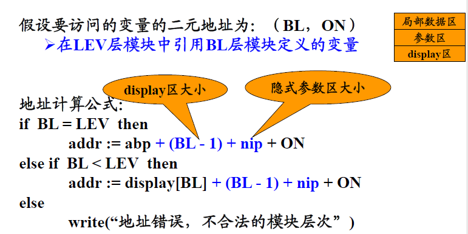

# 第七章 运行时的存储组织及管理 

## 概述  

1. 运行时的存储组织及管理  
    目标程序运行时所需要存储空间的组织与管理以及源程序中变量存储空间的分配。  
2. 静态存储分配和动态存储分配  

   + 静态存储分配
       在编译阶段由编译程序实现对存储空间的管理，和为源程序中的变量分配存储的方法。  
       **条件**：数据空间大小已知。  
   + 动态存储分配
        在目标程序运行阶段由目标程序实现对存储空间的组织与管理，和为源程序中的变量分配存储的方法。
       **特点**:
        + 在目标程序运行时进行分配。  
        + 编译时要生成进行动态分配的目标指令。  

## 静态存储分配  

## 动态存储分配

分配策略是：整个数据区为一个堆栈
（1）当进入一个过程时，在栈顶为其分配一个数据区。  
（2）当退出一个过程时，撤消该过程的数据区。  

### 活动记录  

  

1. 局部数据区：
    存放模块中定义的各个局部变量。  
2. 参数区：
    存放隐式参数和显式参数。  
     
    
    prev abp:存放调用模块记录基地址。函数执行完时，释放其数据区，数据区指针指向调用前的位置。  
    ret addr：返回地址，即调用语句的下一条执行指令地址。  
    ret value: 函数返回值（无值则空）
    形参数据区： 每一形参都要分配数据空间，形参单元中存放实参值或者实参地址。  

3. display区：
    存放各外层模块活动记录的基地址。  

变量二元地址（BL、ON）：
BL： 变量声明所在的层次。可以用它找到该层数据区开始地址。  
ON： 相当于显示参数区开始位置的位移（相对地址）。  

### 建造display区的规则  

1. 从i层模块进入（调用）j层模块：  
    复制i层的display, 然后增加一个指向i层模块记录基地址的指针。
2. 若$j\leq i$即调用外层模块或同层模块：  
    将i层模块的display区中的前面j-1个复制到第j层模块的display区。  

### 运行时的地址计算  

  

