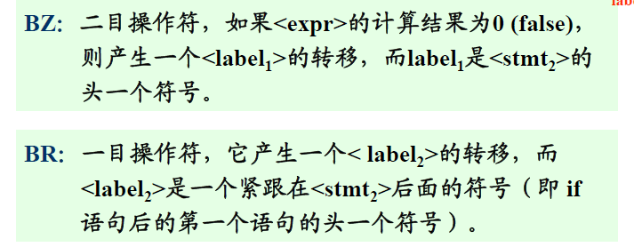

# 第八章 源程序的中间形式  

## 波兰表示  

后缀表达式  

### 波兰表示法的优点：  

1. 在不使用括号的情况下可以无二义地说明算术表达式。  
2. 波兰表达法更容易转换成机器的汇编语言或机器语言。操作数出现在紧靠操作符的左边，而操作符在波兰表示中的顺序即为进行计算的顺序。  
3. 波兰表示不仅能用来作为算术表达式的中间代码形式，而且也能作为其他语言结构的中间代码形式。  

### if语句的波兰表示

if 语句: if\<expr> then $<stmt_1>$ else <$stmt_2$>  

波兰表示为： $<expr><label_1>BZ<stmt_1><label_2>BR<stmt_2>$  

  

## N - 元表示  

+ 间接三元式：  
    为了便于在三元式上作优化处理，可使用间接三元式。 
    三元式的执行次序用另一张表表示，这样在优化时（三元式位置的变更实际是执行顺序的变化），三元式可以不变，而仅仅改变其执行顺序表。  

+ 四元式表示：  
      

## 抽象机代码  

+ 该堆栈式计算机主要由若干寄存器、一个保存程序指令的储存器和一个堆栈式数据及操作存储组成。  

### 拉链回填  

