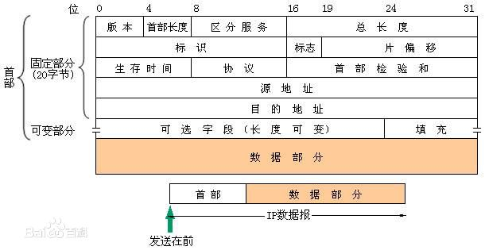

# 计算机网络Notes

## 网络层-IP地址

### IP的基本概念 

IP定义数据传送的基本单元——IP分组及其确切的数据格式。协议包括一套规则，指明分组如何处理、错误怎样控制。特别是，IP协议还包含非可靠投递的思想，以及与此关联的分组路由选择的思想。

#### IP地址的作用  

连接在Internet中的每一台主机（或路由器）都分配一个32位的全球唯一的标识符。

#### IP报文结构  

1. **版本**  v4或v6  
2. **首部长度**  以32位为单位，最常用是20字节，最大值为60字节。  
3. **总长度** 指首部和数据之和的长度，单位为字节，因此数据报的最大长度为$2^{16}-1=65535$字节。以太网帧的最大传送单元$MTU$为1500字节。  
4. **标识** 代表分片时候的序号，但是并不是序号，因为IP是无连接的服务。  
5. **标志** 最低位$MF$为1表示后面还有分片，为0表示没有分片。标志字段中间的一位是$DF$，只有当$DF=1$是才允许切片。  
6. **片偏移** 以8个字节为单位， 表示当前分片距离第一个数据位的偏移量。  
7. **首部检验和** 只校验分组的首部，而不校验数据部分。  
8. **生存时间TTL** 每经过一跳路由器就会减1， 当TTL被减为0时就会被丢弃。  
9. **协议** 6表示TCP， 17表示UDP  
10. **源地址字段** 表示发送方的IP地址  
11. **目的地址字段** 表示接收方的IP地址  

### IP地址的划分  

传统的IP地址划分为A、B、C、D、E五类。

IP地址 := {<网络号>， <主机号>}  

类别|最大网络数|IP地址范围|单个网段最大主机数|私有IP地址范围  
---|---|---|---|---
A|126($2^7-2$)|0.0.0.0-127.255.255.255|16777214|10.0.0.0-10.255.255.255  
B|16384($2^{14}$)|128.0.0.0-191.255.255.255|65534|172.16.0.0-172.31.255.255  
C|22097152($2^{21}$)|192.0.0.0-223.255.255.255|254|192.168.0.0-192.168.255.255 

+ **主机号全为0表示本网络本身**  
+ **主机号全为1表示本网络的广播地址**  

### 子网的概念及子网划分

#### 子网掩码 

一个与IP地址相对应的长32bit的二进制串，它由一串1和跟随的0组成，“与”运算

#### 子网划分  

划分子网的基本思路如下：  

+ 划分子网纯属一个单位内部的事情。单位对外仍然表现为没有划分子网的网络  
+ 从主机号借用若干个比特作为子网号，当然主机号也就相应减少了相同的比特。三级IP地址的结构如下：IP地址 = {<网络号>，<子网号>， <主机号> }  
+ 凡是从其他网络发送给本单位某个主机的IP数据报，仍然是根据IP数据报的目的网络号，先找到连接在本单位网络上的路由器。然后此路由器在收到IP数据报后，再按目的网络号和子网号找到目的子网。最后就把IP数据报直接交付给目的主机。  

